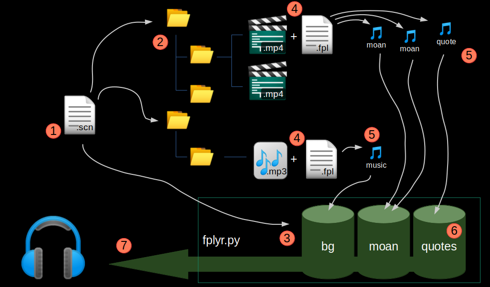

# Fplyr

Fplyr is a background audio sample and music player specialized in playing moaning sounds and relaxing music for adult entertainment purpose.


*Safe for Work* Example which includes *goat sounds* instead of female moans:

https://github.com/pronopython/fplyr/assets/108393305/b85f5101-a5ba-4901-ae20-6c5873531396


With fplyr you can define audio samples like lustful moans and (if you like) rubber clothing squeeching which are extracted from your video files and played back in a defined random fashion on multiple audio tracks while you have your hands free to do other things!

Fplyr stands for fap-player -- what you want fplyr to play is totally up to you!

- [Installation](#installation)
- [Start the Demo!](#start-the-demo)


# Here's how Fplyr works


Next to your video files you want some moaning extracted from you place a small text file with the same name and the extension .fpl. Within this file you list all of your favorite moans by start and end timestamp from the video.

Fplyr will then recursivly find all your defined video files and their samples and play these for you.


# Features

- Define hundreds of samples to randomly choose from very easy
- Specify different layers for different types of samples, e.g. lustful moans, dirty quotes, rubber squeeches, insertion sounds, background music and so on
- Play layers continuously or with a random pause between samples. So you can play moans back to back and a quote every minute
- Play samples of a layer in multi tracks (called "busses" in Fplyr), so that you overlay multiple moans and hear them simultaniously
- Pan randomly, so that you hear some moans left, some moans right
- Define samples to be played back at slower speed while keeping the same pitch. Excellent for some moans!
- Define samples to be shifted in pitch up and down to have even more fun with moans!
- Define a background music
- Uses ffmpeg as a converter, so it plays nearly all video and audio files


# Requirements

* Microsoft Windows or Ubuntu Linux (was written on Ubuntu, should work on all big distros). Works probably on MacOS when tweaked
* Python 3
* FFMPEG for Video to Audio Conversion
* PIP Python Package Manager

and you have to provide your own video (audio) collection, as Fplyr comes only with a save for work example


# Installation


## Ubuntu Linux Installation

### 1. Clone this repository

Clone this repository into a writeable directory.

### 2. Install ffmpeg

`sudo apt-get install ffmpeg`

ffmpeg is used to convert videos to audio files.

### 3. Install pyaudio and portaudio development files via apt

sudo apt install python3-pyaudio portaudio19-dev

(Otherwise pip installer will fail later with a portaudio.h error (see troubleshooting section).)

### 4. Install fplyr via pip

In the repo's root (where `setup.py` is located) run

`pip install .`

It installs fplyr via Python's PIP.


## Windows Installation


### 1. Clone or download this repo

Yes, clone or download this repo now!

### 2. Install Python

Download and install Python 3

[https://www.python.org/downloads/windows/](https://www.python.org/downloads/windows/)

### 3. Install ffmpeg

The following steps will explain how to install ffmpeg and set the PATH variable in short, but you can also refer to good manuals on how to install ffmpeg on windows like this one [https://phoenixnap.com/kb/ffmpeg-windows](https://phoenixnap.com/kb/ffmpeg-windows).

#### 3.1 Download and install ffmpeg.

ffmpeg is used to convert videos to audio files.

Go to

[https://ffmpeg.org/download.html](https://ffmpeg.org/download.html)

and download one of the latest windows bin packages.

Unpack it into e.g. `C:\ffmpeg\bin`

#### 3.2 Add ffmpeg to Windows PATH

Open the *Edit the system environment variables* program.

Click the "Path" variable and press "Edit..."

Choose "New" to add an additional path.

Copy and paste the path you just installed ffmpeg to into the dialog (in this example `C:\ffmpeg\bin`).


### 4. Install fplyr via pip

Start (doubleclick) `install_windows.bat`

It installs fplyr via Python's PIP.


# Start the demo!


## Linux Demo

Go into the example directory of the repo and start the demo with

`fplyr example.scn`

This will generate the .fpx files and play the goat moan example (safe-for-work!).

To close fplyr just close the terminal or hit Ctrl-C.


## Windows Demo

Go into the example directory of the repo and start the demo with a doubleclick on

`start_example_windows.bat`

This will generate the .fpx files and play the goat moan example (safe-for-work!).

To close fplyr just close the window.


# How does it work?



You define one `.scn` file which you start fplyr with (1). Within this file you define which folders fplyr should traverse recursivly in search for `.fpl` files (2). Also you define the layers you want to hear (e.g. "bg", "moan", "quotes") (3).

Right next to a video or audio file you create a `.fpl` file with the exact same name but just the extension `.fpl` instead of e.g. `.mp4` (4). The `.fpl` file specifies all your audio samples you want fplyr to extract and play (5). E.g. from the movie file on top we extract 2 moan samples and one quote.

Fplyr puts all these samples into their specific layer (6) and plays them randomly from these layers (7). E.g. the layer "bg" ("background") might only contain one complete `.mp3` music file, the "moan" layer plays moaning up to three samples in parallel continously and the "quotes" layer plays a random quote every 20-60 seconds. Of course, you can configure all that to you personal liking within the `.scn` and `.fpl` files (1),(4).


# SCN File

The scene file is a YAML file which acts as a playlist and defines, which layers to play and how to play them.

Fplyr takes one SCN file to start playing. You can however create different SCN files for different moods, e.g. with or without quotes, with or without background music etc and start Fplyr with one of these files.

Let's have a look at the example.scn file in the example dir:

```
root_dirs:
  - '.'

layers:
  - layer: bg
    busses: 1
  - layer: quote
    busses: 1
    waittime_min_sec: 10
    waittime_max_sec: 15
    random_pan: True
  - layer: moan
    busses: 2
    random_pan: True
```


This SCN file defines one base dir, which is the current dir "`.`". You can list more than one dir here if you e.g. keep music and videos in sepearte dirs. Note that these are *base* dirs and are crawled *recursivly*!

The SCN file then lists 3 layers: "bg", "quote" and "moan".

Layer "bg" will be the background music player. This picks up the mp3 file to playback in the background.

Layer "quote" plays the quotes. Again, one bus only so one quote per time. Also, the pause between quote samples is 10 to 15 seconds. Quotes will randomly panned left to right speaker.

Layer ""moan" plays moaning sounds again with random panning, so some sounds come from left, some from right. The moan layer has 2 busses, so 2 moans will be played simultaniously. Since no waittime is defined, all samples are randomly played back-to-back per bus.


# FPL File

The FPL file defines the samples and the layer of each sample of one media file.

A FPL file exists one time per used media file and you will use a lot of fpl files.


Everytime you want to use a part or the whole audio of a media file you have to create a text file with the same name as the media file but with the extension .fpl.


The minimal content of the .fpl file is a layer command followed by one sample definition:
```
layer moan
1:23 1:30 deep loud moan
```

Here we say that fplyr should use the sound between 1 minute and 23 seconds and 1 minute and 30 seconds as a sample for the layer "moan". After the timestamps you can put an optional comment.

## Sample definition (timestamps)

Every sample is defined in a separate line:

`[start hh:mm:ss] [end hh:mm:ss] [optional comment]`

You can omit hour and minutes if these are 0.

End timestamp `-1` is used to define the sample till end of file.


Examples:

|Example   | Explanation |
|-----------------|-----------|
|`23 40`| Sample from 23 seconds till 40 seconds|
|`23 40 juicy`| Sample from 23 seconds till 40 seconds with comment "juicy" |
|`55 1:20`| Sample from 55 seconds till 1 minute and 20 seconds|
|`1:05:02 1:05:27`| Sample from 1 hour, 5 minutes and 2 seconds till 1 hour, 5 minutes and 27 seconds|
|`0 -1`| Whole file will be one single sample regardless of its size |


## FPL File commands


A command must be issued *before* the sample definition via timestamp to take effect on this sample.

Example:

```
layer moan
1:23 1:30 deep loud moan
pitch 2
2:10 2:18 bright moan
```

In this example the *second* moan starting at 2:10 is pitched by 2 semitones up. The first one is not pitched.


|Command      | Example | Description                                                                              |
|-----------------|-----------|-------------------------------------------------------------------------|
| repeat  | repeat  | Repeats the first picked audiosample indefinitly  |
| vol X   | vol -10 | Decreases the audio volume by -X db (Example: -10 = half as loud) |
| layer L   | layer bg| sets the layer (here named "bg") |
| bucket B   | bucket loud|  sets the bucket (here named "loud") |
| speed S   | speed 0.5| sets the speed of the samples (0.5 = 50% speed)  |
| pan P   | pan -0.8  | pans the samples (-1.0 left, 0.0 center, 1.0 right) |
| pitch S | pitch 2 | Raise or lower the pitch in S semitones (Example: 2 = voice sounds higher) |


Comments are possible with `#`.

> :cherries: *Layers set to repeat will pick exactly one audio sample per bus and repeat this sample indefinitly*

> :cherries: *You can only decrease volumen with negative numbers. Positive values are ignored, because making the sound louder would often distort the audio*

l
# Usage ideas

## random background music

You can mix in relaxing mp3 music in the background:

Define a `bg` background layer in your `.scn` file:

```
layers:
  - layer: bg
```

And for every mp3 you want randomly to be included create a `.fpl` file with one sound sample:


```
layer bg
0 -1
```


## quotes from time to time

Define a `quote` layer in your `.scn` file, which uses 1 bus and waits between 15-60 seconds until it plays the next sample. Random pan your quotes to hear them in different stereo spaces.

```
layers:
  - layer: quote
    busses: 1
    waittime_min_sec: 15
    waittime_max_sec: 60
    random_pan: True
```

Use `layer quote` to define quotes in your `.fpl`  files:

```
layer quote
22 38 Very dirty quote
```


## slow moan

You can mix normal moan with moan that is slowed down and played at half speed. Just add every sample definition again after a `speed 0.5` definition.

Example `.fpl` file:
```
layer moan
23 28
1:10 1:25
speed 0.5
23 28
1:10 1:25
```


## Chipmunk / High Voice Moan

You can raise the pitch of the moans to let them sound higher.
Use this to convert your favorite 40-year-old star back to her early 20s!

Example `.fpl` file with moans raised by 2 semitones:

```
layer moan
pitch 2
23 28
1:10 1:25
```

Try values between 2 and 4 semitones.


## buckets (to be implemented)

> :cherries: *Buckets are not working yet*

A layer can be split up into buckets and each bucket has a play-probability.
This is used to split moaning up into normal moans and "finishing-moans" with the latter only played once in a while.


## hotkeys (to be implemented)

> :cherries: *Hotkeys are not working yet*

Hotkeys will switch on / off a layer.


# How to download videos

Fplyr only works with video files and not with online streams. Theirfor you need to download your favorite videos.

Here is a list of possibilites to download videos from various sites:

## firefox rightclick (works on few sites)
Firefox can download videos in its right click menu. This menu is often blocked or overwritten by a custom menu by the site's player. You can force to show the right click menu by holding shift key down while right clicking.


## youtube-dl & yt-dlp fork (works on many sites)

Use yt-dlp instead of the original youtube-dl, because it can handle more websites.

Do not install it via apt, because you normally get an old version by doing so. Use pip instead.


# Troubleshooting


|Problem        |Solution                                                     |
|---------------|-------------------------------------------------------------|
| The scn file is not accepted |Be careful to format it according to YAML standard. E.g. do not mix spaces indention with tabs! |
|Sound is sometimes choppy | Totally normal for python audio :-)  |

# Install errors

While installing with pip you get a *portaudio.h error*

Install pyaudio and portaudio develop package via apt:

`sudo apt install python3-pyaudio`

`sudo apt install portaudio19-dev`

And then you must reinstall pyaudio via pip:

`pip3 install --upgrade pyaudio`

Otherwise you will get this error when running fplyr:

SystemError: PY_SSIZE_T_CLEAN macro must be defined for '#' formats


# Known bugs and limitations
* audio interrupted (pyaudio problem)
* No normal way to exit fplyr because keyboard handling does not work (fplyr needs a gui)


# Technical Stuff

## why ffmpeg
Fplyr uses pyaudio and pyaudio handles modern codecs and formats very well. Old videos (like "real media" `.rm` files) and other strange formats (mono 22kH etc) do not work or break fplyr or (that's even more evil) result in loud distorted audio. So fplyr uses ffmpeg to convert every media file to a clean mp3 with 2 channels at 44.1 kH. This is the `.fpx` file that fplyr creates. ffmpeg was chosen because it never showed problems with any file.


